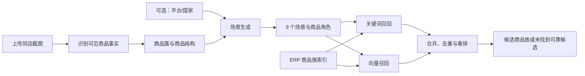

# 店铺场景灵感助手 MVP 设计规格

- 状态：待用户审阅
- 日期：2026-08-31
- 项目：`store-scenario-inspiration`

## 1. 摘要

本项目帮助运营人员从同一家店铺的一组商品截图出发，识别截图中可见的商品结构，生成新的店铺场景灵感，并将每个场景拆成可检索的商品角色，再从公司 ERP 产品清单中返回可靠的主 SKU 商品族候选。

MVP 的核心不是复述截图里已经出现的商品，也不假设店铺已经建设了某些场景，而是完成以下闭环：

```text
同店截图
  -> 可见商品识别
  -> 商品簇与店铺商品结构推断
  -> 9 个新场景灵感
  -> 每个场景 5–8 个商品角色
  -> ERP 关键词 + 向量混合检索
  -> 每个角色 3–5 个可靠商品族候选，或明确说明当前 ERP 未找到可靠候选
```

MVP 优先建设商品检索底座：先形成可重复的数据清洗、主 SKU 商品族文档和人工检索基准，再接入向量索引。独立的“向量数据库服务”不是先决条件；检索质量主要取决于文档语义、清洗规则和评测集，而不是存储产品的品牌。

## 2. 目标

1. 用户只需上传同一家店铺的一张或多张商品截图，即可获得完整分析。
2. 平台和国家是可选输入；不填写时仍能生成市场中性的结果。
3. 从截图中提取可见商品事实，并归纳店铺的商品簇与商品结构。
4. 默认生成 9 个彼此有明显差异的场景灵感，不再预设“保守延展、相邻拓展、探索机会”三类配额。
5. 每个场景拆分为 5–8 个“商品角色”，描述该场景需要什么，而不是预先指定某个 SKU。
6. 使用关键词检索和向量检索共同召回 ERP 商品，经重排后返回可靠候选。
7. 清楚区分截图事实、系统推断、ERP 数据事实和探索性建议。
8. 任意场景中的任意商品角色都可能在 ERP 中没有可靠候选；此时明确显示“当前 ERP 未找到可靠候选”，不强行匹配，也不改变场景类型。

## 3. 非目标

MVP 不包含：

- 抓取或自动操作 Shopee 等电商网页；
- 店铺链接、店铺 ID、商品 ID、截图日期或排序方式；
- 登录、账号体系、店铺管理和跨次持续跟踪；
- 保存、拒绝、历史记录和反馈学习；
- 截图图片向量检索；
- 自动修改 ERP 原始 Excel；
- 全量商品主数据治理平台；
- 为 MVP 单独部署微服务集群或独立向量数据库服务；
- 销量预测、定价、库存承诺或市场规模结论。

这些能力只有在首轮输出质量通过人工验证后才进入后续范围。

## 4. 已确认输入契约

### 4.1 必填

- 一张或多张商品截图；
- 一次分析中的截图默认属于同一家店铺。

### 4.2 可选

- 平台，例如 Shopee；
- 国家或市场，例如泰国。

### 4.3 明确不要求

- 店铺首页链接；
- 店铺商品 ID 或平台商品 ID；
- 截图的排序方式；
- 截图日期；
- 店铺档案或历史上传记录。

商品 ID 不是识别商品类型或生成场景的必要条件。MVP 在单次请求内合并多张截图，并通过视觉与文本特征处理重复商品；不承诺跨请求追踪同一个平台商品。

## 5. 用户流程与系统边界



系统由一个可部署应用组成，内部按职责划分模块，不拆微服务：

1. 单页上传与结果界面；
2. 分析 API；
3. 截图识别适配器；
4. 商品聚类与场景生成器；
5. ERP 商品族索引构建器；
6. 混合检索与重排器；
7. 结果组装器。

模型和存储供应商不是产品契约。实现应通过窄接口隔离，首版选择最少的运行依赖。

## 6. 截图理解

### 6.1 识别结果

对每个清晰可见的商品卡片，尽量提取：

- 规范化商品类型，例如折叠桌、露营椅、帐篷、风扇；
- 截图可直接支持的属性，例如尺寸、材质、容量、便携性；
- 卡片在截图中的位置和来源截图；
- 识别置信度；
- 用于审计的简短视觉或 OCR 依据。

价格、销量、评分等字段只有在清晰可见且确实参与分析时才提取；MVP 不依赖这些字段。

### 6.2 去重与商品簇

多张截图可能包含重复卡片。系统在本次请求内按商品图片、规范化商品类型和可见标题相似度去重。随后将商品归入较稳定的商品簇，例如：

- 户外遮蔽；
- 户外家具；
- 夏季降温；
- 收纳运输；
- 露营与野餐辅助。

“商品簇”是对截图中商品结构的归纳，不代表店铺已经经营了对应的消费场景。

## 7. 场景生成与结果契约

### 7.1 统一场景集合

“保守延展”和“相邻拓展”都在描述场景与截图商品的距离，边界不稳定；“探索机会”又错误混入了 ERP 是否有货这一检索结果。MVP 因此不再把 9 个场景硬分成三类。

所有场景使用同一套生成标准：

- 能从截图识别出的商品、商品簇或能力出发说明生成依据；
- 描述一个具体的人群、空间或时机以及需要完成的任务；
- 给出该场景为什么需要这组商品角色的组合逻辑；
- 可以加入截图中没有出现的商品角色，以补全任务链；
- 不以 ERP 是否存在候选商品限制场景生成。

系统先生成更大的候选场景池，再按以下维度去重和选出 9 个：核心任务、使用空间或时机、目标人群、关键商品角色组合。两个场景如果只有名称不同而这些维度基本相同，只保留一个。场景与截图的关联依据可以展示，但不再作为固定层级或配额。

### 7.2 每个场景的字段

- 场景名称；
- 一句话说明；
- 目标人群、使用空间或时机、核心任务；
- 来源依据：引用商品簇或已识别商品事实；
- 主要推断；
- 5–8 个商品角色；
- 场景整体置信度与限制。

### 7.3 每个商品角色的字段

- 角色名称，例如“便携遮蔽”“夜间照明”；
- 角色意图：商品在场景中解决的任务；
- 检索查询结构；
- 目标 3–5 个 ERP 主 SKU 商品族候选；
- 候选不足时允许少于 3 个；
- 没有达到可靠阈值时显示“当前 ERP 未找到可靠候选”；
- 每个候选的匹配理由、命中依据和风险提示。

## 8. ERP 数据源与商品族模型

当前只读数据源：

`E:\download\Chrome下载\产品列表下载20260831093944283.xlsx`

当前文件 SHA-256：`BA9AFD5A3C1A92E9E75727E747FDF10DC8AD55FD0F2A75A5505DA05FFD36CDA8`。

已经核验的当前数据画像：

- 13,072 条子 SKU 记录；
- 8,550 个主 SKU 商品族；
- 1,955 个多变体商品族，覆盖约 49.55% 的子 SKU 行；
- 多变体商品族中，中文商品名称约 95.70% 会随变体变化，而英文名称仅约 8.95%、英文关键字仅约 4.60% 会变化；
- 英文名称与英文关键字约 80.95% 完全相同；
- 英文字段约 4.2% 为占位或低信息文本；
- 仅使用英文文本时，精确重复约 50.49%；
- 加入中文商品名称后，精确重复降至约 2.20%；
- 商品目录几乎总是最深层级目录，不能与层级字段重复灌入语义文本。
- `销售状态` 完整度约 10.34%，`产品定位` 和 `型号` 完整度分别约 1.42% 和 1.22%。

这些数字是当前文件的画像，不是永久业务常量；每次重建索引都应重新生成质量报告。

### 8.1 核心字段用途

| 源字段 | MVP 用途 | 处理原则 |
| --- | --- | --- |
| `商品名称` | 最主要的中文商品类型、属性和变体来源 | 原值完整保留；首版不做可能误删容量、尺寸等信息的激进切词 |
| `英文名称` | 英文关键词召回和中文名称的交叉验证 | 过滤占位符；与英文关键字相同时只使用一次 |
| `英文关键字` | 补充英文别名和检索词 | 不因字段名是“关键字”就提高固定权重；低信息或与名称重复时降权/去重 |
| `商品目录` | 商品类别关键词和类型校验 | 作为叶子目录只使用一次；完整一至四级路径另存为元数据 |
| `主SKU` | 聚合和返回商品族 | 不进入语义文本，不参与相关性打分 |
| `sku` | 返回可购买或可查看的子变体 | 作为子变体元数据，不进入向量文本 |
| `销售状态` | 平台风险或禁售提示 | 当前完整度低，只对明确值生效，缺失不能推断为可售 |
| `产品定位`、`型号` | 暂不作为核心召回字段 | 当前填充率过低，可保留原值但不依赖 |

因此，用户提出的四个文本字段不是四选一：`商品名称`承担中文主语义，`英文名称`和`英文关键字`去重后补充英文召回，`商品目录`承担类别校验。向量文本使用从这些字段中规范化出的商品类型、功能、空间、任务和关键属性，而不是直接把四列原文无差别拼接。

### 8.2 一条检索文档对应一个主 SKU 商品族

`mainSKU` 只承担以下职责：

- 聚合同一商品族的子 SKU 变体；
- 作为检索结果的稳定返回标识；
- 连接 ERP 原始记录。

`mainSKU` 的编码字符串不得进入向量文本，也不得作为语义相关性依据。

商品族文档最小结构：

```json
{
  "doc_id": "main:CJA4131",
  "main_sku": "CJA4131",
  "searchable": true,
  "keyword_fields": {
    "cn_names": ["涤棉/蓝树叶冰凉巾", "纯棉/蓝色条纹冰凉巾"],
    "en_aliases": ["cooling towel"],
    "leaf_categories": ["..."],
    "category_paths": [["...", "..."]]
  },
  "vector_text_v1": "商品名称：涤棉/蓝树叶冰凉巾；纯棉/蓝色条纹冰凉巾",
  "children": [
    {
      "sku": "CJA4131C",
      "display_name": "涤棉/蓝树叶冰凉巾",
      "sales_status_raw": "",
      "status_flags": []
    }
  ],
  "quality": {
    "group_size": 7,
    "flags": []
  },
  "index_meta": {
    "schema_version": "...",
    "cleaning_rules_version": "...",
    "source_sha256": "...",
    "embedding_model_id": "..."
  }
}
```

索引器显式只索引 `keyword_fields.*` 和 `vector_text_v1`。`doc_id`、`main_sku`、子 SKU 与销售状态均为元数据。MVP 不从当前 ERP 字段臆造功能、空间和任务；这些信息来自场景商品角色查询侧。若以后增加离线语义补全，必须单独保存来源、置信度和生成版本，并用检索基准证明它确实改善结果。

## 9. 数据清洗与索引构建

清洗在索引构建时完成，不修改源 Excel。

### 9.1 确定性清洗

1. 精确校验必需表头，尤其是 `sku`、`主SKU`、`商品名称`、`英文名称`、`英文关键字`、`商品目录`。
2. 保留 SKU 编码的字符串类型和前导零。
3. 对比较值执行 Unicode NFKC、首尾空格清理和连续空白折叠，同时保留原值用于展示与追溯。
4. 只有整格等于 `0`、`1`、`无`、`n/a`、`na`、`none`、`null`、`unknown` 或 `未知` 才按占位符移除；不能删除真实名称中的 `2TB`、`16寸`、`40L`、数量或颜色。
5. 对同一主 SKU 聚合子 SKU，组内按规范化后的精确值去重；所有子 SKU 原始名称和变体信息完整保留。
6. 首版不使用泛化正则强行删除颜色、尺寸、数量或款式。只有经过真实样例覆盖的有限操作备注标记才能从向量名称尾部截断，且截断前必须已有有效商品文本。
7. 英文名称与英文关键字完全相同时只在 `en_aliases` 中保留一次。
8. 叶子目录按四级、三级、二级、一级的最后一个非空值确定；商品目录与叶子目录相同时只进入一次关键词文本，完整目录路径作为元数据和可选过滤条件。
9. 冲突字段不静默覆盖，写入 `quality.flags` 并降低相关性可信度。
10. 商品族向量名称按确定性顺序排列，每个名称最长 120 个字符、每族最多 8 个；相同输入重复构建必须得到相同文档哈希。
11. 每次构建输出记录数、商品族数、缺失率、占位率、冲突率和重复率，异常时中止发布新索引。

这不是人工逐行清洗。规则在构建管道中批量执行，人工只负责查看质量报告和少量抽样。原始数据继续保持只读，因此工作量可控、规则可复跑、结果可回滚。

### 9.2 关键词索引文本

关键词索引包含：

- 规范化中文商品类型；
- 商品族内去重后的中文商品名称；
- 去重后的英文名称和英文关键字；
- 最深层商品目录；

字段权重顺序为中文商品名称（高）、目录叶子与路径（中高）、有效英文名称和英文关键字（低）。英文只补充召回，不得主导结果。

### 9.3 向量文本

首版向量文本只采用清洗、去重后的中文商品名称，不把整行字段机械拼接：

```text
商品名称：涤棉/蓝树叶冰凉巾；纯棉/蓝色条纹冰凉巾
```

选择这一最小文本的依据是：中文商品名称当前完整度和区分度最高；英文存在高重复、占位和错配，目录则与最深层级完全重复。角色查询仍包含商品类型、任务、空间和属性，由嵌入模型在查询侧完成语义匹配。这样不会把模型推断伪装成 ERP 原始事实。

不进入向量文本的内容：

- `mainSKU` 和子 SKU 编码；
- 英文名称和英文关键字；
- 商品目录和目录层级；
- 销售状态、备注、型号和产品定位；
- 采购备注、内部状态码和无语义占位符。

### 9.4 索引版本

一次成功构建产生一个不可变索引版本，至少记录：

- 源文件指纹与更新时间；
- 清洗规则版本；
- 语义补全版本；
- 嵌入模型标识；
- 文档数量与质量指标；
- 构建时间。

只有质量检查通过的新版本才替换当前活动版本。

## 10. 混合检索

### 10.1 商品角色查询

场景中的每个商品角色被转成结构化查询：

```json
{
  "product_type": "便携风扇",
  "task": "户外休息时降温",
  "space": "露营地",
  "required_attributes": ["便携"],
  "optional_attributes": ["充电式"],
  "excluded_attributes": []
}
```

### 10.2 召回与重排

1. 关键词检索从商品名称、英文关键词和商品目录召回精确或近似名称候选。
2. 向量检索以完整角色查询匹配商品族中文名称向量，召回名称不同但语义相近的候选。
3. 合并两个候选池并按 `mainSKU` 去重。
4. 依据商品类型一致性、任务相关性、属性满足度、目录支持和数据质量进行重排。
5. 对商品类型冲突、仅命中低质量英文文本或存在明显排除属性的候选降权或剔除。
6. 仅返回超过可靠阈值的前 3–5 个商品族；可靠候选不足时返回更少。
7. 候选为商品族，界面同时展示该族的代表名称与子 SKU 变体。

主 SKU 不参与第 1、2 或第 4 步的语义匹配。

### 10.3 向量存储边界

第一阶段不得因为“需要向量检索”就先引入独立向量数据库服务。8,550 条向量即使使用 1536 维 Float32，原始向量约 50 MiB，单进程精确余弦扫描足以支持 MVP：

- 先生成并验证 8,550 个商品族文档、关键词索引和嵌入；
- 使用单文件 SQLite 保存商品族、子 SKU、构建元数据和 FTS 关键词索引；
- 向量以连续 Float32 数据与文档行映射保存，应用启动时加载内存并做精确近邻查询；
- 新索引完成质量检查后以整包原子替换活动版本；
- 只有当延迟、并发、增量更新或运维指标证明当前方案不足时，再迁移独立向量数据库。

索引访问必须封装为简单接口，使底层存储可替换，但不提前设计多套实现。

## 11. 平台与国家的作用

- 未填写时：不生成依赖特定市场的事实性判断，不使用平台限制做硬过滤。
- 填写时：可用于语言呈现、场景适配和已明确规则的商品风险提示。
- 如果 ERP 中存在可验证的平台禁售或销售状态字段，可在相应平台下过滤或警告；系统不得凭模型猜测平台合规性。

平台和国家不能影响截图能否提交，也不能成为生成场景的前置条件。

## 12. 异常与降级

- 截图无法读取：指出具体失败图片，允许用户替换后重试。
- 部分卡片模糊：继续分析可识别内容，并展示覆盖度和低置信度项。
- 截图识别服务失败：本次分析失败，不伪造商品事实。
- ERP 索引不可用：场景仍可生成，但商品角色显示“检索暂不可用”；不能把所有角色错误标为“当前 ERP 未找到可靠候选”。
- 没有可靠 ERP 候选：显示“当前 ERP 未找到可靠候选”，但场景本身保持不变。
- 只有少量可靠候选：少量返回并说明原因，不补足低质量结果。
- 平台/国家缺失：按市场中性模式处理，不报错。

## 13. 界面结构

MVP 为单页流程：

1. 上传区：支持多图、删除和预览；
2. 可选字段：平台、国家；
3. 提交与处理中状态；
4. 识别摘要：可见商品事实、商品簇、覆盖度和不确定项；
5. 场景结果：展示去重并排序后的 9 个场景，不按固定类型分组；
6. 场景卡片：说明、依据、推断、5–8 个商品角色；
7. 商品角色行：3–5 个可靠候选或“当前 ERP 未找到可靠候选”，并可展开子 SKU 变体和匹配理由。

MVP 不提供历史列表、保存按钮、拒绝按钮或跨分析比较。

## 14. 数据与隐私

- 截图按单次请求处理，MVP 不建立持久店铺档案；
- 只保留完成请求所需的临时文件，并按运行环境策略清理；
- ERP 原始工作簿和完整索引只在服务端使用；
- 模型重排只接收当前角色所需的最小候选字段，不发送整份 ERP；
- 结果中的依据标明来源类型：截图事实、ERP 字段、模型推断或探索性假设；
- 源 Excel、用户截图和本地分析产物不得提交到 Git 仓库。

## 15. 质量评测与验收

### 15.1 截图与场景验收

使用当前同一家店铺的 4 张截图作为首个固定样例：

- 清晰可见的商品卡片中，至少 80% 能归入可用的规范化商品类型；
- 固定输出 9 个场景，且不存在只改名称的同义场景；
- 每个场景有 5–8 个商品角色；
- 截图事实与系统推断分开展示；
- 平台和国家为空时仍能完成分析。

### 15.2 检索基准

在实现 UI 前建立 20–30 个由人确认的商品角色查询，覆盖：

- 精确商品名；
- 中英文名称差异；
- 使用任务或空间描述；
- 多变体商品族；
- ERP 无可靠候选；
- 英文字段占位或冲突；
- 容易混淆的相邻商品类型。

对于人工确认 ERP 中存在目标商品族的查询，首版目标为 `Hit@5 >= 75%`。同时人工检查前 5 名中是否出现明显错误类型。该基准用于比较清洗、关键词、向量和重排的改动，不能只凭几个演示样例判断质量。

### 15.3 数据构建验收

- 源 Excel 保持未修改；
- 每个有效主 SKU 只产生一个商品族文档；
- `mainSKU` 和子 SKU 编码不出现在向量文本；
- 相同英文名称与英文关键字不重复；
- 子 SKU 变体可从商品族结果追溯；
- 质量报告中的总行数和商品族数可与源文件核对；
- 技术性检索失败与“无可靠商品”在结果中严格区分。

首批自动化边界样例直接取自当前工作簿：

| 主 SKU / SKU | 需要锁定的行为 |
| --- | --- |
| `ZXOD3713` | 英文名称与关键字只保留一份，向量仅含中文名称，不含任何 SKU 编码 |
| `ZXOD2149` | 40L、70L、8L 三个子变体聚为一个文档，容量与颜色信息不丢失 |
| `AZZWAC1167` | 33 个子变体全部可追溯，向量名称不超过 8 个，避免文本无限增长 |
| `2C0409` | 混合叶子目录写入质量标记，返回时不把全组误称为同一种商品 |
| `ZXNXK0726-N2` | 中文是帽子而英文错写为内裤时，英文不进入向量，中文驱动召回 |
| `LSLFBA579A` | 英文名称、关键字和申报名均为 `1` 时按占位符移除 |
| `YMXFBA346B` | 中文金属笔与英文园艺词、育苗盆目录冲突时，中文名称向量不被污染 |
| `UKLYCLH012AG` | 英文字段为空但中文名称有效时仍可搜索并生成向量 |
| `test1123` / `test2` | 名称、英文和目录均空时保留审计记录，但 `searchable=false` 且不生成向量 |
| `YNFBA997` | 标记 Shopee 违禁时，平台为 Shopee 才过滤；平台未填时保留并显示风险 |
| `ZXMO528` | 只有部分子 SKU 带 Ali 高退款时，风险保持在子变体粒度 |
| 任意目录完整记录 | 商品目录等于最深层目录时只产生一个叶子类别，不重复加权 |

全量不变量包括：8,550 个唯一商品族文档、13,072 个唯一子 SKU、占位符不进入索引、不可搜索文档不生成嵌入、向量模板不包含 SKU 编码，以及相同输入两次构建得到相同的规范化文档哈希。

## 16. 实施顺序

1. 固化字段映射、商品族文档 schema、确定性清洗规则和质量报告；
2. 建立 20–30 条人工检索基准及预期商品族；
3. 实现关键词索引并测量基线；
4. 生成向量文本和嵌入，加入向量召回；
5. 实现合并、去重、重排和可靠阈值；
6. 接入截图识别、商品簇和 9 场景生成；
7. 完成单页上传与结果展示；
8. 使用当前 4 张截图做端到端验收。

该顺序先验证“ERP 中能否可靠找到商品”，再建设完整交互，避免把检索问题隐藏在漂亮界面之后。

## 17. 当前决策与实现约束

- 已确认 MVP 输入、9 场景结构、商品角色数量和候选数量。
- 已确认使用关键词 + 向量混合检索。
- 已确认一条检索文档对应一个主 SKU 商品族。
- 已确认主 SKU 仅用于归组和返回，不参与语义匹配。
- 已确认先自动化清洗和评测，再决定是否需要独立向量数据库。
- 实现计划可以选择具体语言、框架和模型，但必须保持单应用、最少依赖、可本地验证，并遵守本文的数据和接口边界。
